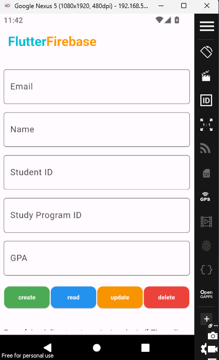

# flutter-master

flutter course and fundermental concepts

## flutter rirebase connection

### firebase cli installation

- DOWNLOAD AND INSTALL CLI FROM BELOW LINK

[https://firebase.flutter.dev/docs/cli]

### VS CODE SECTION

- Configure Flutter fire (flutterfire configure)
- Install firebase core
- Initialize app (from firebase_options.dart)

| Crud Operations              |
| ---------------------------- |
|  |
